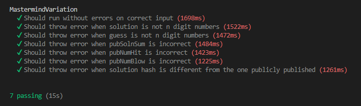
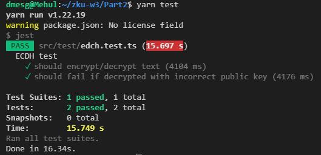

# zku.ONE C-4

**_Discord:_** mehultodi116@gmail.com  
**_Email:_** kid116#4889

## Week 3
### P1: Circom in Games

#### Q1
**What have the authors done in their implementations to protect them from brute-force attacks?**

Since there are a small number of permutations for the private input signals, it is possible for the code-breaker to find the solution by going through all possible permutations and check if the `pubSolnHash` is a match. The authors have added the private signal `privSalt` which guards against such an attack. Since the code-breaker cannot know this private input known to the code-maker which is required to find the hash of the solution, they cannot check if the hash of a guess matches the solution hash.

#### Q3
**In `test/mastermind-test.js`, write unit tests to test the functionality of the Mastermind Variation circuit. Attach a screenshot of your unit tests passing.**

#### Q4
**Suggest a game that can be implemented using ZK.**

Higher Lower
- *How it is played*  
    The game is somewhat similar to mastermind as there is a gamemaster who picks a random number and the player must uncover this number as fast as possible. The player can make a guess and for each of these guesses, the gamemaster informs him whether the hidden number is greater than - "higher" or less than "lower" than the number guessed.

- *How it can benifit from ZK*  
    The gamemaster might be dishonest about the number he picked or the player may not trust his response to his guesses. This is where zk-proof comes in which does not let the gamemaster change their number at the last moment and also convince the player that the gamemaster is being honest.

- *how it is protected from brute-force attacks*  
    The `privSalt` private input unknown to the player protects against brute-force attacks as mentioned above for Mastermind.

### P2: Anti-Collusion and Fairness

#### Q1
**1 - Summarize how MACI works.**

The MACI contract is used to curb collusions during voting. The coordinator of the vote deploys the contract to which users can sign up to within a set period of time, upon owning a particular ERC721 token optionally, to be eligible to vote. Any eligible voter may then vote by sending their command signed by their EdDSA keypair generated during registration. After the end of the voting period, each of these commands must be processed and a zk-proof must be generated proving that the command was handled correctly and finally a zk-proof validating the entire tally of votes is generated by the coordinator.

**2 - What kind of collusion(s) does MACI solve?**

MACI does not allow anyone besides the coordinator to decrypt their vote as a proof for their the way they voted. This reduces the effectiveness of bribery as their is no way to know for sure if the bribe was effective.

**3 - What kind of collusion(s) does MACI not solve?**

One major drawback of the MACI protocol is that the coordinator of the vote must be trusted and assumed to be unbiased and they can decipher one's vote and find the way they voted meaning they can verify if their bribes were fruitful.

#### Q2
**3 - Attach a screenshot of the tests passing.**

#### Q3
**Explain in 1-3 sentences why, in computing VDFs, having many computers operating in parallel won't help you to find the solution more quickly.**

VDFs may be defined such that it is not parallelizable and therefore, many computers operating in parallel won't be helpful in finding the solution more quickly. For example, the repeated squaring used in Pietrzak Scheme VDF cannot make use of multiprocessor architechture and no information about the solution can be extracted before the final squaring.

### P3: Final Project

#### Q1
**Suppose you are building a ZK blind auction application and the circuit is already built for you. Write down an implementation plan, including what other components you will need to build, the order in which you will build your components, as well as what frameworks/tools you will use.**

Firstly, a smart contract which handles all operations that go on in the backend must be written in a secure, gas efficient and readable manner. There must be a way to signup for the auction which can be taken care of using `Semaphores`. To place a bid, the encrypted bid must be stored on the blockchain along with the hashed key and some amount of flat fee must also be paid as a security deposit. Sellers must be able to add their items to with the fee required to bid for the item. After the auction is over, the bidder must make a call to the contract with a proof of their bid amount generated using zk-SNARKs and the amount must be transferred as well. Finally, the ownership for the item is handed over to the highest bidder and others are refunded their deposits and payments only if they have proven the amount they bid. After the smart contract has been written, the frontend must be designed for the end-user to interact with the contract along with the in-browser JS scripts to handle the activities of the user.

**Suggest three candidate ideas for your final project. Explain (1) the problem tackled, (2) a design overview, and (3) obstacles anticipated in approx. 200 words for each idea.**

1. **Higher Lower**  
    It is a quick and fun game of guessing numbers where each of the two players bet certain number of tokens to play with which do not hold any monetary value. Two players battle it out over several in a winner takes all game. For each round, they pony up certain number of tokens unknown to the opponent and settle on the number of moves in which the hidden number is to be discovered. One of the players is randomly chosen to set this number and the other must fish it out using verdicts given by the them. For each guess the playing hiding the number must tell whether the hidden number is higher of lower than the number guessed. To make things interesting, the verdict given might be incorrect. The player guessing the number gets certain number of chances to challenge this verdict to which the other player must respond with a zk-proof for its validity. Failure to do so will result in the guessing player's victory. Since the project is relatively simple, their aren't many obstacles which are expected. The only problem might be the integration of VDFs for the random picking of one of the players during each round since I haven't done this before.

2. **Scotland Yard**  
    It will be an attempt at recreating the classic game of Scotland Yard where Mr. X must cover his tracks and hide from being discovered by the other players in the vast map. There will be lots of zk-proofs involved in the project where a similar token system might be implemented as before. The frontend for the project might prove to be difficult. As there are many rules for the game. Also, implementing web-RTC to create a smooth experience for the users might be difficult as I do not have much experience in the field but it would be a great learning experience. Since Mr. X is supposed to keep his game hidden, it is perfect game to implement on blockchain making use of zero-knowledge proofs. Also, whether a move made by Mr. X is valid or not may also be implemented using zk-proofs without actually knowing the status of Mr. X's game. All in all, it would be amazing if I'm able to implement this project and it would interest a lot of users as well.

3. **Telepathy**  
    Telepathy is another fun game which may be implemented using zk-proofs since it requires some information to be hidden which is not very easily done in blockchain applications. It is a board game with different symbols of different colors in cells of a grid. One of the players, chooses a cell in the grid and the other must figure out the chosen hidden cell. The player may guess a row, column, symbol and color and the other player must acknowledge with a "Yes" even if one of the attributes is a match else "No". This project again is a simple one and I do not expect running into major troubles while developing the same. The only problem which I may face with the other ideas as well is web-RTC integration for smooth real-time multiplayer interation during the game. All of these projects must have a polished\intuitive frontend with a seamless user experience to gain traction with a robust implementation which might prove to be very time consuming to achieve.